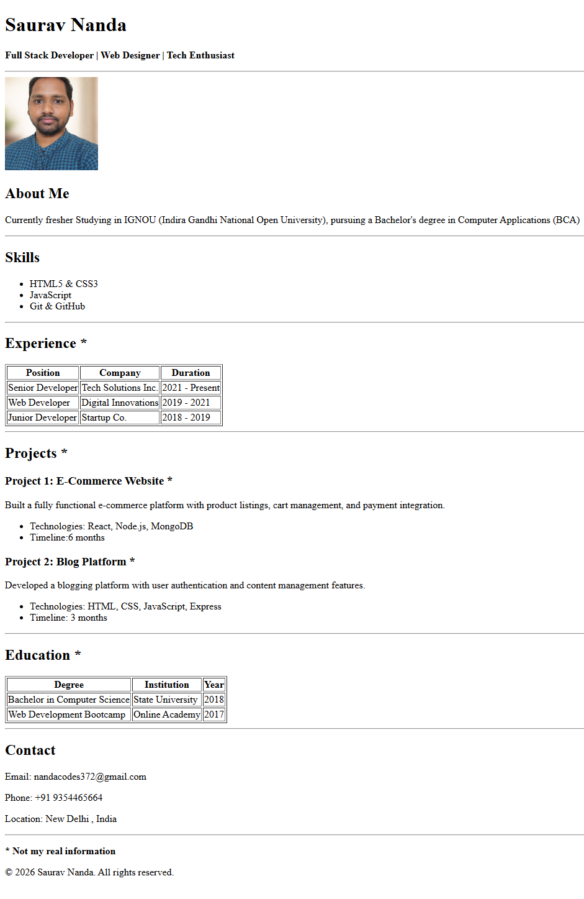

# HTML Resume – Saurav Nanda

single-page HTML resume using basic HTML.  
for learning HTML Tags

## Project Description

Resume sections:

- Header with name and title  
- About section  
- Skills list
- Experience table
- Projects section
- Education table
- Contact details

**Note:** not real my real information.
##  Live Site

https://nandacodes-dev.github.io/ChaiCode/resume.html

## You can also

Clone or download the repository

git clone https://github.com/nandacodes-dev/ChaiCode.git

